<div align="center">

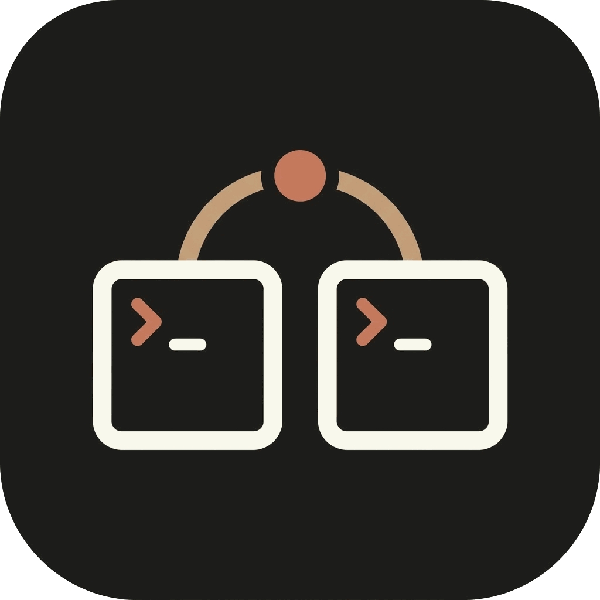

<h1>bridger</h1>

<p><em>Let two Claude Code sessions talk to each other.</em></p>
<p><strong>No copy-paste. No re-explaining. The session that knows, answers.</strong></p>

<p>
  
  
  
  
</p>

<p>
  <a href="#install">Install</a> ·
  <a href="#real-use-cases">Use cases</a> ·
  <a href="#quick-start">Quick start</a> ·
  <a href="#architecture">Architecture</a> ·
  <a href="#comparison">Compare</a> ·
  <a href="#faq">FAQ</a>
</p>

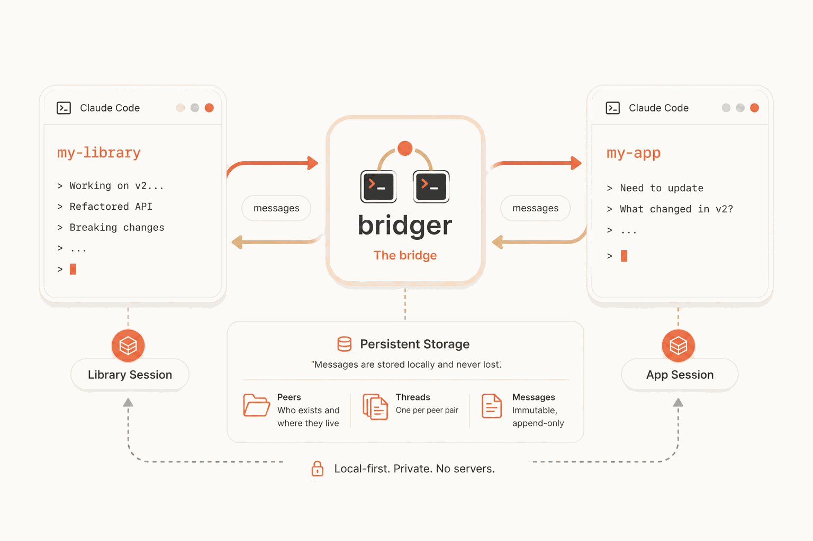

</div>

---

You're deep in a library session that just made breaking changes. The consumer app's session knows nothing about them — so you copy-paste diffs and re-explain, every time.

bridger removes that step. Sessions register as named peers and message each other through a local file bus. Ask *"what changed?"* and the **session that made the change** answers — from its own live context, not a second model guessing.

```
> /bridger:ask my-library what breaking changes did you make in v2?

Response from my-library:
  1. login() -> authenticate(), now takes a Config object
  2. getUser() -> getCurrentUser(), returns UserProfile
  3. refreshToken() removed — refresh is automatic now
```

See the full exchange in [Live Example](#live-example) below.

## Why Bridger?

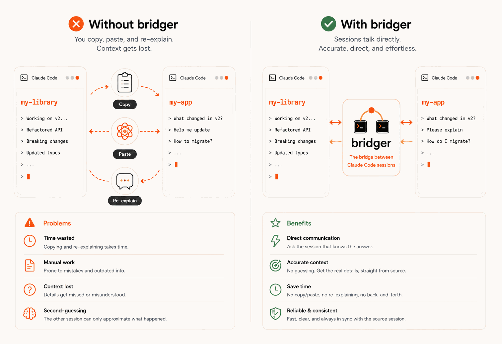

You have more than one Claude Code session open — any two on the same machine — and one knows something the other needs. Different repos, different branches, or two sessions on the **same branch in the same folder**: bridger lets them ask each other, instead of you translating between them.

| Where your two sessions are | Works? |
|---|---|
| Different repos | ✓ |
| Same repo, different branches or worktrees | ✓ |
| **Same repo, same branch, same folder** | ✓ — each session registers its own name |
| Different machines | ✗ — one laptop is the boundary (no network, by design) |

Identity follows the **session**, not the folder, so two sessions sharing one directory stay distinct. The only line bridger won't cross is the machine: everything is local files, nothing goes over a network.

> **Not for everything.** Three unrelated features that never need each other's reasoning? Skip this, use [worktrees](#faq-why-not-just-use-worktrees) — bridger *complements* them, it doesn't replace them. It earns its keep the moment one session would otherwise *guess* at what another one knows.

## Quick Start

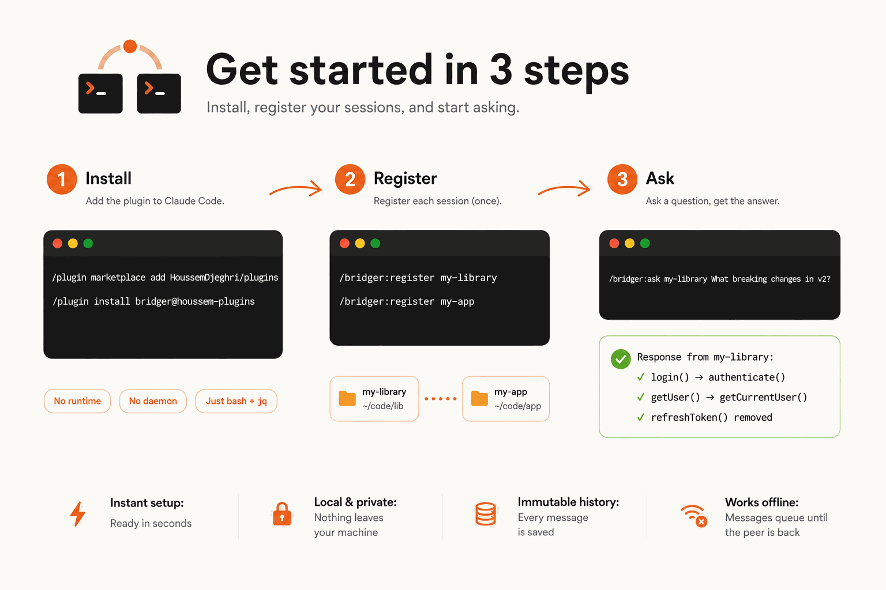

**1. Install** — requires [jq](https://jqlang.github.io/jq/) (`brew install jq` / `apt install jq`)
```
/plugin marketplace add HoussemDjeghri/plugins
/plugin install bridger@houssem-plugins
```

**2. Register** each session, once
```
/bridger:register my-library
/bridger:register my-app
```

**3. Ask**
```
/bridger:ask my-library what breaking changes in v2?
```

Restart your sessions after installing so the `SessionStart` hook is active.

## Live Example

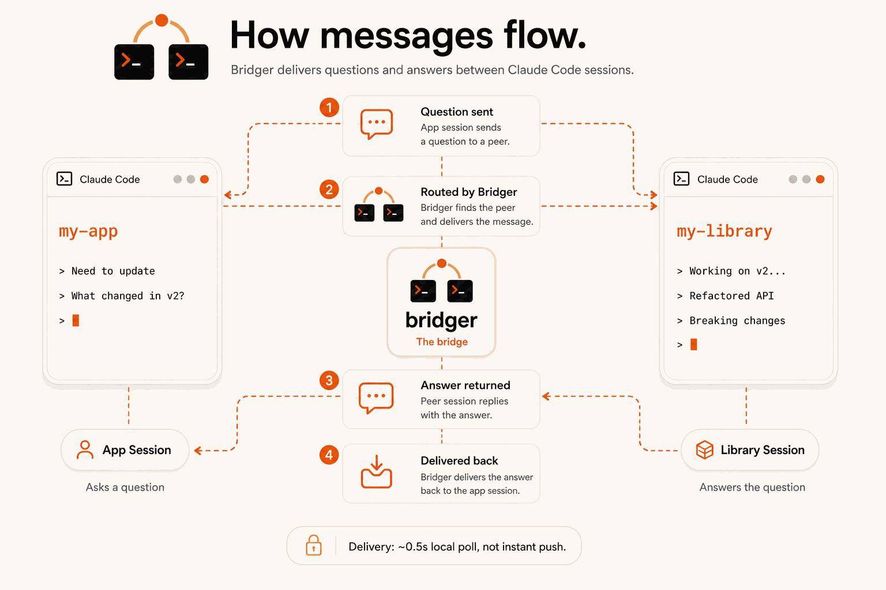

```
# Terminal 1 — my-library
> /bridger:register my-library
registered 'my-library' -> ~/code/my-library
(watch armed — incoming messages surface as notifications)

# Terminal 2 — my-app
> /bridger:register my-app
> /bridger:ask my-library what breaking changes did you make in v2?

Response from my-library:
  1. login() -> authenticate(), now takes a Config object
  2. getUser() -> getCurrentUser(), returns UserProfile
  3. refreshToken() removed — refresh is automatic now
```

Or skip the commands — tell your agent *"update our app to the new my-library version, ask its session about the breaking changes"* and the bundled skill does the rest.

<details>
<summary><strong>See the full step-by-step flow</strong></summary>
<br>
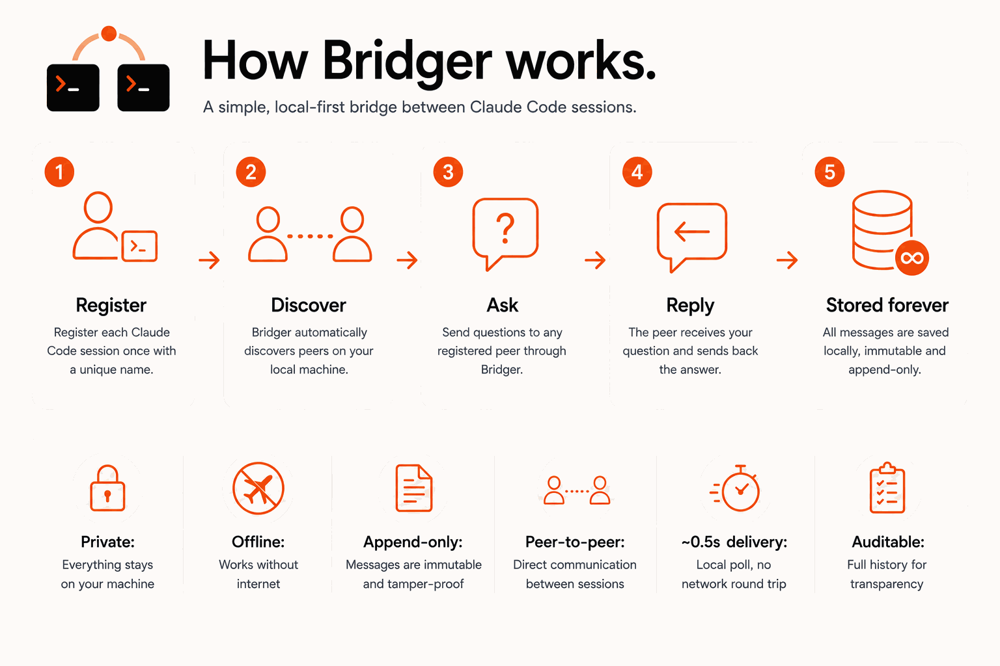

1. **Register** — each session registers once with a unique name.
2. **Discover** — bridger finds peers on your local machine automatically.
3. **Ask** — send a question to any registered peer.
4. **Reply** — the peer answers from its own live context.
5. **Stored forever** — every message is saved, immutable, append-only.
</details>

## Architecture

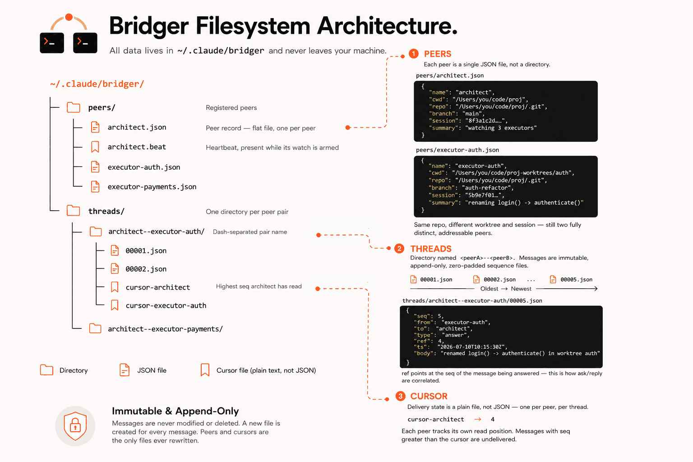

No server, no daemon, no network. Plain JSON files under `~/.claude/bridger/`.

| Property | Behavior |
|---|---|
| Messages | Immutable, append-only — every thread doubles as an audit log (`bridger log <peer>`) |
| Writes | Atomic via hard-link; sequence-number races retry automatically, no locks |
| Identity | Per session, opt-in — each session registers a name; two sessions in one directory stay distinct (identity follows the Claude Code session id, with the directory as fallback). Unregistered sessions stay invisible |
| Discovery | `bridger peers` shows live status, directory, branch, and an optional self-set summary |
| Delivery | Hook-driven — `SessionStart` surfaces unread messages and arms a background watcher |
| Correlation | `bridger ask` blocks until a reply whose `ref` matches the question's `seq`; counter-questions avoid deadlock |

> Why files instead of a server? They're debuggable (`cat` any message), they queue while a peer is offline, and they need nothing but bash and `jq`.

## Real Use Cases

<table>
<tr>
<td colspan="2">

**🪢 Parallel worktrees, one architect** — *the flagship*

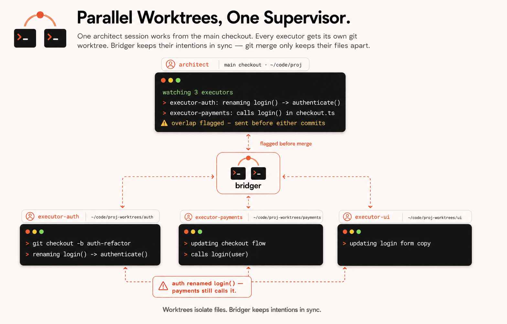

One **architect** session works from the main checkout; each **executor** gets its own `git worktree` and a slice of the task. Every executor reports what it's about to touch; the architect — the only one seeing every worktree at once — flags an overlap **before** it's written, not when the merge fails. It even catches the clashes `git merge` can't: a rename in one worktree and a new caller of the old name in another merge *clean* and break the build. Worktrees isolate the files; bridger keeps the **intentions** from colliding. One architect ↔ many executors is a shape a subagent can't take — a single mind that watches N independent sessions at once.

</td>
</tr>
<tr>
<td width="50%">

**📦 Library migration** — *the one that started it*

Bump a shared package, ask its session what changed and why — instead of copy-pasting a changelog.

</td>
<td width="50%">

**🧭 Coordinator ↔ worker** — *plan high, execute cheap*

A coordinator session runs at high effort and makes the calls; a worker session runs at **low effort** — faster, far fewer tokens — and implements. bridger carries the decisions between them, and `bridger mirror` turns them into a committable log. You spend top-tier reasoning only where it's needed.

</td>
</tr>
<tr>
<td width="50%">

**📡 Offline handoff**

Kick off a long job, or ask a peer that isn't running yet — bridger queues the message and delivers it the moment that session comes back online.

</td>
<td width="50%">

**🔌 Frontend ↔ backend contract**

The API session changed a response shape; the UI session asks for the new fields straight from the session that just wrote them — no stale OpenAPI file.

</td>
</tr>
<tr>
<td width="50%">

**🗂️ Monorepo, split by concern**

One session per service. When a change in one affects another, they ask each other instead of one session juggling the whole tree.

</td>
<td width="50%">

**🧾 Durable audit trail**

Every exchange is an immutable numbered thread. `bridger mirror` renders it to a markdown log you can commit.

</td>
</tr>
</table>

<details>
<summary>See it drawn out — library migration, planner/builder, and offline handoff</summary>
<br>

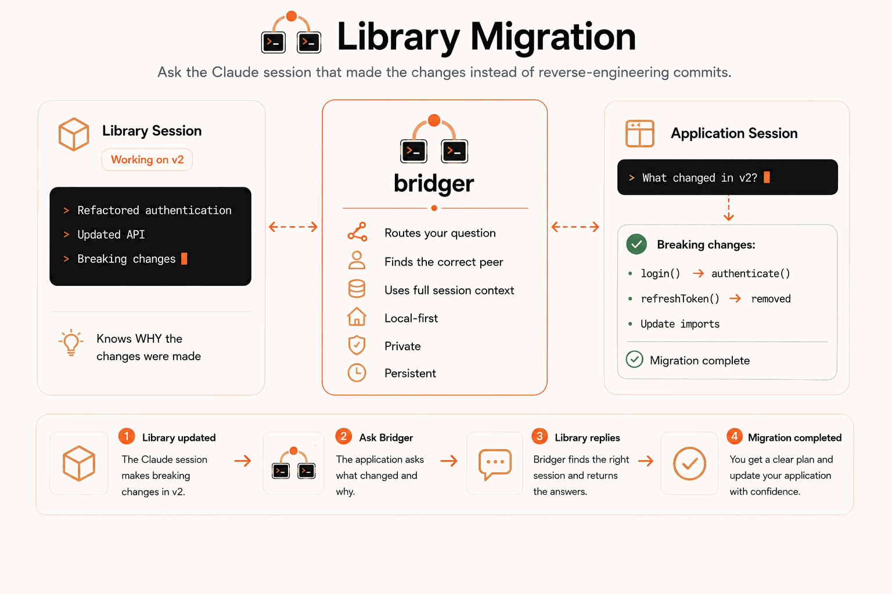
<br><br>
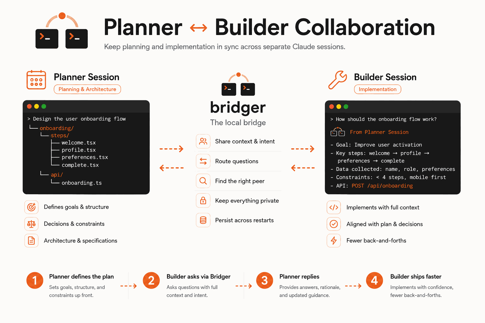
<br><br>
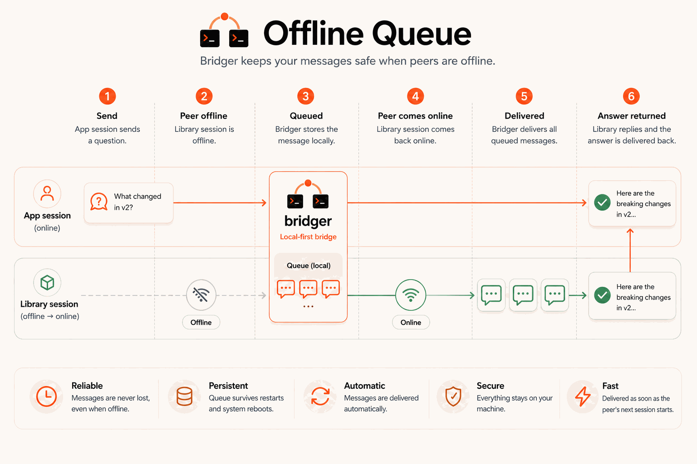

</details>

## Features

<details>
<summary>See all 10 features</summary>
<br>

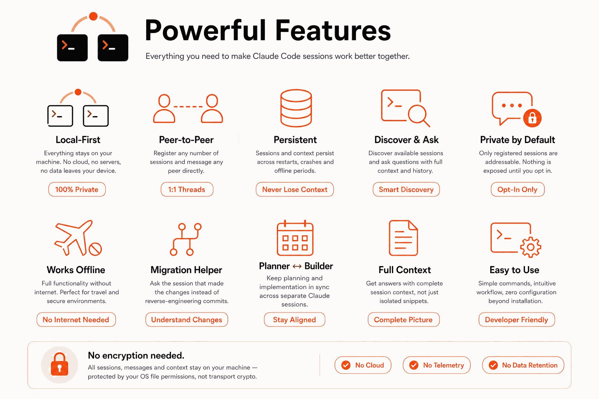

</details>

## Install

Requires [jq](https://jqlang.github.io/jq/) (`brew install jq` / `apt install jq`).

**Recommended** — via the `houssem-plugins` marketplace, so future plugins install with one `/plugin marketplace update`:
```
/plugin marketplace add HoussemDjeghri/plugins
/plugin install bridger@houssem-plugins
```

<details>
<summary>Other install methods</summary>
<br>

**Just this plugin** — add its own repo directly:
```
/plugin marketplace add HoussemDjeghri/bridger
/plugin install bridger@houssem-plugins
```

**From a local clone** (for hacking on it):
```
git clone https://github.com/HoussemDjeghri/bridger
/plugin marketplace add /path/to/bridger
/plugin install bridger@houssem-plugins
```
</details>

Restart your sessions after installing so the `SessionStart` hook is active.

<details>
<summary>Uninstall</summary>
<br>

```
/plugin uninstall bridger@houssem-plugins
/plugin marketplace remove houssem-plugins
```
Message data under `~/.claude/bridger/` is yours; delete it separately if you want the threads gone too.
</details>

## Commands

| Command | What it does |
|---|---|
| `/bridger:register <name>` | Register the current project as a peer and arm the watch |
| `/bridger:peers` | Who is addressable, their status and what they're doing |
| `/bridger:ask <peer> <question>` | Ask a peer and wait for its answer (blocks, ~120s timeout) |
| `/bridger:send <peer> <message>` | Fire-and-forget message |
| `/bridger:status` | Identity, known peers, unread counts |
| `/bridger:log <peer>` | Full conversation history with a peer |

The underlying CLI (`bin/bridger`) works standalone too — `bridger help` lists `peers`, `summary`, `register`, `join`, `leave`, `whoami`, `send`, `poll`, `wait`, `ask`, `log`, `mirror`, `status`. Scripts and CI can send messages to your sessions with it.

`bridger mirror <peer>` renders selected message types (default `stop,ruling`) as deterministic markdown you can commit — regenerable from any checkout.

Delivery is token-cheap: each message arrives as one terse line (`#<seq> <from> <type>[ re#<n>]: <body>`), not full JSON — the agent pays for the content, not the envelope. `poll --json` / `ask --json` return complete stored objects when scripts need fields.

## Comparison

bridger isn't a replacement for agent teams or claude-peers — it solves a different problem: persistent, asynchronous messaging between independent sessions.

**Use [agent teams](https://code.claude.com/docs/en/agent-teams)** when one session needs to fan work out — parallel review, a task list with dependencies.

**Use [claude-peers](https://github.com/louislva/claude-peers-mcp)** when peers should find each other with zero setup and messages should land instantly, and a background daemon is a fine trade.

**Use bridger** when the conversation has to *survive* — queued for a session that isn't running, delivered after a restart, kept in a log you can read back months later. One plugin, no daemon, no port, no permission-bypassing flags — the option that still works under an API key or in a locked-down setup.

<details>
<summary>Full side-by-side comparison table</summary>
<br>

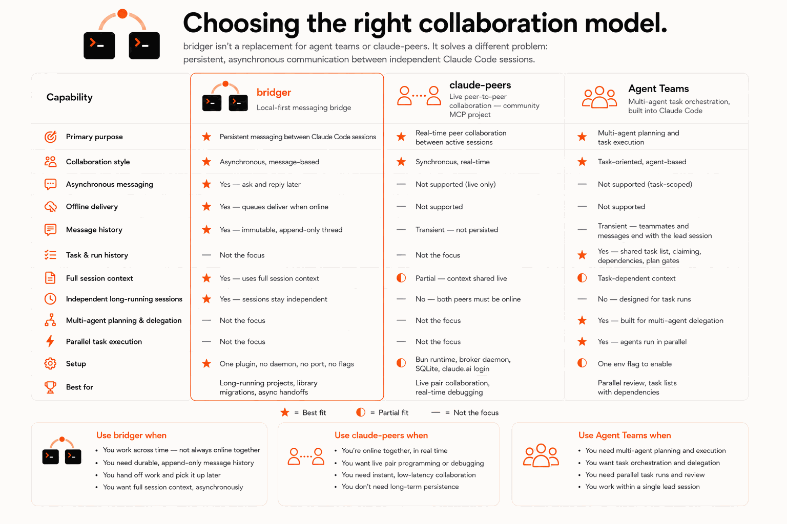

*Checked 2026-07-17 against the Claude Code agent-teams docs (v2.1.178+) and the claude-peers README. Both move fast — verify before relying on a row.*

</details>

## Security

- Same user, same machine only. No auth, no encryption — the mailbox relies on `~/.claude` being yours. Don't bridger across trust boundaries.
- Private by default: an unregistered session can't be discovered or messaged, and its chat never sees bridger traffic. Auto-join (`CLAUDE_BRIDGER_AUTO=1`) is a mode you turn on, not a default you turn off — `bridger leave` opts a single directory back out.
- Message bodies are agent-generated text — treat them as context, not commands to execute blindly.
- One consumer per peer name. Threads are pairwise; no groups yet.
- 99999 messages per thread ceiling — far beyond a working conversation; delete the thread directory to reset.

See [ROADMAP.md](ROADMAP.md) for what's next; version history is the git log (semver in `.claude-plugin/plugin.json`). Contributions welcome: run `./test.sh` before a PR, open an issue first for anything beyond a small fix.

## FAQ

<details>
<summary id="faq-why-not-just-use-worktrees"><strong>Why not just use worktrees and merge later?</strong></summary>
<br>

Often the right answer. [Git worktrees](https://code.claude.com/docs/en/worktrees) let sessions work in parallel without touching each other's files, and `git merge` reconciles the result. If your parallel work is file-disjoint, use worktrees — free, built in, already the answer.

Worktrees solve file conflicts. They don't move knowledge:

- **Why, not what.** A diff shows `login()` became `authenticate()`. It doesn't say the old call swallowed a refresh failure — the session that made the change knows; git never carried it.
- **Questions a merge can't answer.** "Is this rename intentional?" A merge conflict tells you two edits collided, not which is right.
- **Work that isn't committed yet.** The knowledge exists mid-session, before any commit — exactly when the other session needs it.
- **Repos that never merge.** A library and its consumer from a registry share no history to defer to.
- **Cost asymmetry.** Asking is one message. Discovering the same fact through a failed build costs a whole review cycle.

They compose: worktrees keep the *files* apart, bridger keeps the *reasoning* together. The sharpest version — one architect in the main checkout plus several executors, each in its own worktree — is the [flagship use case](#real-use-cases): overlaps get caught before they're written, including the semantic ones a clean `git merge` hides.
</details>

<details>
<summary><strong>Why not just use subagents to talk to each other?</strong></summary>
<br>

Often you should — they're not the same tool, and a subagent isn't the weaker one. A **subagent** (the Task tool) starts with a **fresh** context and can run its **own model and effort** (an Opus-high session can call an Opus-max subagent for a hard decision). Its answer returns into your session's context; then it's gone. Reach for one when the other mind is **on-demand and subordinate**: *spin up a reviewer for this decision, take its answer, continue.* Simpler, nothing left running.

Reach for bridger when the other mind must be a **peer that persists** — three things a subagent structurally can't be:

- **Durable, accumulating memory on both sides.** A subagent starts blank every call; it knows only what you re-feed it, and re-feeding a phase of history back in bloats *your* context. A bridger peer is a real session that remembers across phases without you carrying its mind.
- **Authority, not just answers.** A subagent is called and returns — it can't watch your work, start a conversation, or **halt** you. A peer can push a "stop," ask its own questions, and run **concurrently** while you proceed.
- **Its own lifetime.** A peer exists before you start and after you finish, across many sessions and worktrees, and you can open, read, and steer it yourself. A subagent lives and dies inside one of your turns.

Rule of thumb: subagent to **consult** within a task; bridger to **coordinate** with a session that has its own memory, authority, and lifetime. (Both can log their decisions — that part's a wash.)
</details>

<details>
<summary><strong>Does bridger work across machines?</strong></summary>
<br>
No — same user, same machine only. See <a href="#security">Security</a>.
</details>

<details>
<summary><strong>"this directory is not registered as a peer"</strong></summary>
<br>
Run <code>/bridger:register &lt;name&gt;</code> first — a session is addressable only after it registers a name (identity follows your session, with the directory as fallback).
</details>

<details>
<summary><strong>"jq is required"</strong></summary>
<br>
Install <a href="https://jqlang.github.io/jq/">jq</a> — it's bridger's only dependency, nothing else to set up.
</details>

<details>
<summary><strong>Why does <code>ask</code> time out?</strong></summary>
<br>
The peer session isn't listening (closed, or watch not armed). Its unread count keeps growing in <code>/bridger:status</code>; messages deliver when it next starts.
</details>

<details>
<summary><strong>Two sessions in the same repo — or the same branch, same folder?</strong></summary>
<br>
Fully supported. Each session registers its own name (<code>/bridger:register architect</code>, <code>/bridger:register executor</code>) and they talk directly — no subdirectory trick needed. Identity follows the Claude Code <em>session</em>, not the directory, so two sessions on one branch never collide. Running parallel pairs (two features at once)? Give each a distinct name, e.g. <code>role-feature</code> — <code>architect-auth</code>, <code>executor-auth</code>. A name is held by one live session at a time; a second session claiming a live name is refused, and reclaims it once the holder is gone.
</details>

---

<p align="center">MIT — see <a href="LICENSE">LICENSE</a></p>
